<div align="center">



<br/><br/>

**A Python service that streams Wazuh's security alerts into Apache Kafka with at-least-once delivery, surviving log rotation, truncation, broker outages and process crashes.**

[](https://github.com/Aakhri-Pastaa/ShadowTwin/actions/workflows/forwarder.yml)
[](https://github.com/Aakhri-Pastaa/ShadowTwin/actions/workflows/demo.yml)
[](https://github.com/Aakhri-Pastaa/ShadowTwin/releases/latest)
[](LICENSE)
[](docs/DECISIONS.md)


</div>

---

## What it does

Wazuh writes every detection as one line of JSON to `alerts.json`, and the
full event stream to `archives.json`. ShadowTwin tails both files like
`tail -F`, produces each line to a Kafka topic (`wazuh-alerts`,
`wazuh-logs`), and persists its read position **only after the broker
acknowledges the write**. It runs as a systemd service on the Wazuh manager
host.

<div align="center">

</div>

## The problem

Four things make a naive file-to-Kafka forwarder lose data:

- **Rename rotation** — the path gets a new inode while your handle holds the old one. You stop receiving data, silently and permanently.
- **`copytruncate` rotation** — the inode is unchanged but the file is truncated under your byte offset. You stall, or re-read the file and duplicate everything.
- **Non-atomic appends** — Wazuh writes with ordinary buffered I/O, so a poll can land mid-object: `{"timestamp":"2026-09-20T02:14:0`.
- **The crash window** — die between producing a message and its acknowledgement, and the next start has to know. Checkpoint optimistically and you lose in-flight records; checkpoint per record and it is unusably slow.

Broker outages compound all four, and they correlate with incidents: the
moment a host is under attack is a moment infrastructure is unstable.

## How it works

Each watched file has a checkpoint — the inode plus the byte offset after the
last line confirmed delivered. **It advances only on acknowledgement, never
on read.** Restart resumes from it; the worst case is re-sending what was in
flight.

**Contiguous-prefix acking** (`state.AckTracker`) — Kafka acknowledges out of
order, so message 3 can land before 2. Every line gets a sequence number in a
pending queue; the committed position advances only along the unbroken
acknowledged prefix. Acknowledging 3 while 2 is outstanding moves nothing.
The offset of an in-flight line is never skipped past.

**Atomic checkpoints** (`state.OffsetStore`) — write to a temp file, `fsync`,
`os.replace` into position, then `fsync` the directory so the rename survives
power loss. Never a torn state file. The previous checkpoint is kept as
`.bak` and loaded if the main file is corrupt, which is quarantined to
`.corrupt`. Written every 2 s, not per record, which bounds the duplicate
window without slowing the write path.

**Backpressure, not drops** (`producer.KafkaWriter`) — `acks=all`,
`enable.idempotence`, and `message.timeout.ms=0` so librdkafka retries
forever. When the local queue fills, `produce()` raises `BufferError`;
`send()` catches it, polls for callbacks and retries in a loop, which blocks
the readers until the broker catches up. Unread data stays in the log file,
which is the safest place for it.

**The tailer** (`watcher.FileTail`) — at every EOF it compares `os.stat()`
inode and size against the open handle, as GNU `tail` does without inotify.
New inode: drain the old handle to its end *first*, then open the new file at
zero. Size below offset: seek to zero. Deleted: close, wait, re-attach.
Trailing fragment without a newline: withhold until the newline arrives.

**Guarantee: at-least-once.** In-flight messages are re-sent after a crash.
Duplicates are possible, gaps are not — consumers must deduplicate, typically
on the Wazuh alert ID. Exactly-once would need a transactional sink and
two-phase commit across a file and a network boundary; a duplicate alert is
an inconvenience, a missing one is missing evidence.

## Try it

The whole pipeline runs on one machine with no Wazuh installation:

```bash
cd demo && docker compose up --build
```

Kafka, a generator writing Wazuh-shaped NDJSON, the forwarder, and a consumer
that prints what arrives. Every alert carries a monotonic sequence number, so
the consumer can audit for loss rather than assert it:

```
[audit] received=312 unique=312 highest=312 duplicates=0 | NO GAPS
```

The generator rotates and truncates the log while it runs. Stop the broker
mid-stream with `docker compose stop kafka`, start it again, and the audit
still reports `NO GAPS` — a non-zero `duplicates` count is at-least-once
working as specified. See [`demo/`](demo/).

## Install

On the Wazuh manager host, which is where `/var/ossec/logs` is readable:

```bash
cd forwarder && sudo ./install_service.sh
```

Creates a `nologin` `shadowtwin` user in the `wazuh` group, builds a
virtualenv, installs config to `/etc/shadowtwin-forwarder/config.yaml`
(separate from code, so upgrades never clobber a tuned deployment) and the
systemd unit, then starts and health-checks it. Root to install, not to run.

```bash
systemctl status shadowtwin-forwarder
```

Docker is supported as an alternative; the container needs the host's `wazuh`
GID via `group_add`. Configuration reference, upgrades and troubleshooting:
[`forwarder/README.md`](forwarder/README.md).

## Operation

Four startup checks run before anything is forwarded. Broker and topic
existence are probed with an `AdminClient` metadata request, so the check
cannot itself trigger topic auto-creation:

```
ShadowTwin Forwarder v1.0.0
Forward:  /var/ossec/logs/alerts/alerts.json -> wazuh-alerts
Forward:  /var/ossec/logs/archives/archives.json -> wazuh-logs
startup check: Kafka       OK   (connected to localhost:9092; 1 broker(s) in cluster)
startup check: Topics      OK   (wazuh-alerts, wazuh-logs exist)
startup check: Files       OK   (alerts.json readable; archives.json readable)
startup check: Permissions OK   (/var/lib/shadowtwin-forwarder writable)
```

Only a permissions failure is fatal. An unreachable broker or missing source
file are warnings — both self-heal, and aborting would mean a forwarder that
refuses to start during the outage it exists to survive.

Stats every 60 s; `in_flight=0` means nothing is unaccounted for:

```
stats: produced=1284 acked=1284 failed=0 parse_errors=0 reconnects=0 queued=0 in_flight=0 | offsets: alerts=418223, archives=9912014
```

Broker loss and recovery are logged once each, not per retry:

```
WARNING  producer   all Kafka brokers are down; buffering locally and reconnecting in the background
INFO     producer   Kafka connection restored; deliveries flowing again
```

`python app.py --health` exits 0 when healthy, for monitoring. Both check
modes are print-only and will not create or chown service files if run as
root.

## Testing

```bash
cd forwarder && python tests/smoke_test.py
```

44 assertions in CI on every push, alongside `ruff`. Fault injection, not
happy path — each induces a failure and asserts the recovery:

| Induced | Asserted |
|---|---|
| Out-of-order acks | Committed position holds at the gap, settles both when it closes |
| Corrupted state file | Quarantined to `.corrupt`, `.bak` checkpoint loaded |
| Rename rotation | Old inode drained before the new file is read |
| Truncation | Offset resets to zero, reading resumes |
| Delete then recreate | Tailer detaches, waits, re-attaches |
| Half-written line | Withheld, then emitted once complete |
| Malformed JSON, blank lines | Skipped and settled, not retried forever |
| All-brokers-down then delivery | Reconnect counter increments exactly once |
| Shipped producer config | Accepted by the real librdkafka client |
| Kill and restart mid-stream | Resumes at exactly the right byte — no gap, no repeat |

Linux required: the rotation tests need real inode semantics.

## Limitations

- **At-least-once, not exactly-once.** Consumers must deduplicate.
- **No TLS or SASL to the broker.** Plaintext and unauthenticated — trusted network segments only. Wazuh alerts carry hostnames, usernames and command lines; see [SECURITY.md](SECURITY.md).
- **Single broker** in the default config, though `bootstrap_servers` takes a list.
- **Linux only** — inode-based rotation detection, systemd, POSIX `os.replace`.
- **Tested against Wazuh 4.x on one homelab deployment.** Not validated across versions or benchmarked at production rates.
- **Transport only.** No parsing, enrichment, correlation or storage. Alert contents are never inspected beyond validating each line is syntactically valid JSON.

## Scope, and why it is frozen

ShadowTwin was designed as a closed-loop purple-team lab: Wazuh detects, an
Evaluator triages, an Attacker proves exploitability in a sandbox, a Defender
advises a fix, a human applies it, the Attacker re-runs to prove closure.
**None of it was built.** Scope was frozen at the ingestion layer on
2026-09-20 and the design archived — reasoning in
[`docs/DECISIONS.md`](docs/DECISIONS.md), design in
[`docs/archive/`](docs/archive/).

Second time the project cut on that principle. It started with a custom Go
agent — mutual-TLS transport, CSR enrollment with the key never leaving the
host, certificate renewal and revocation, a crash-safe bounded disk queue,
one-command onboarding. Complete and tested, archived once Wazuh proved the
better foundation: reuse the mature tool, build only the differentiating
glue. Still at [`go-agent-v0/`](go-agent-v0/), still green in CI.

## Documentation

| | |
|---|---|
| 📊 [PROJECT_STATUS](docs/PROJECT_STATUS.md) | What is actually running |
| 🏗️ [TOPOLOGY](docs/TOPOLOGY.md) | Deployment topology |
| 🧭 [DECISIONS](docs/DECISIONS.md) · [ADRs](docs/adr/) | Why things are the way they are |
| 🧰 [forwarder/README](forwarder/README.md) | Config reference, operations, troubleshooting |
| 🧪 [DEPLOYMENT](docs/DEPLOYMENT.md) · [TROUBLESHOOTING](docs/TROUBLESHOOTING.md) | Deep dives |
| 🧪 [demo/](demo/) | One-command environment, no Wazuh needed |
| 📓 [DEVLOG](DEVLOG.md) | Build history |
| 🗄️ [archive/](docs/archive/) | The original design — never implemented |

## Built with

Python 3.12 · [confluent-kafka](https://github.com/confluentinc/confluent-kafka-python) (librdkafka) · Apache Kafka 4 (KRaft) · Wazuh · systemd · Docker

Licensed under [Apache-2.0](LICENSE).
