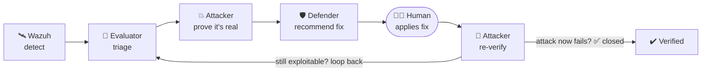

# 🌑 ShadowTwin

### The security lab that proves its own fixes.

**Build a shadow copy of a real environment. Let AI-driven attackers loose on it — safely. Then prove every fix by attacking again.**

---

Most security tooling stops at one of two places: *"we found something"* or
*"we exploited something."* Neither tells you whether the problem is
actually **closed**.

ShadowTwin runs the whole loop. Wazuh detects. An evaluator triages the
noise rules can't resolve. An attacker proves what's really exploitable —
inside the sandbox only. A defender writes the fix as a **recommendation**.
A human applies it. Then the attacker runs again, and only a re-attack that
now fails counts as done.

## ✨ Principles

| | |
|---|---|
| 🔁 **Closed loop** | A finding isn't done when it's patched — it's done when the same attack stops working. |
| 🧰 **Tools-first** | Deterministic tools do the mechanical work. AI is reserved for the ambiguous residue rules can't handle: triage, correlation, explanation. |
| 🧑‍⚖️ **Advisory, human-in-the-loop** | The defender *recommends*. A person decides and applies. **No auto-remediation, ever.** |
| 🧪 **Sandbox-only** | Everything runs against a bundled, deliberately vulnerable environment — never production, never third-party systems. |

## 🧩 Components

| Component | Role | Status |
|---|---|:--:|
| **Wazuh** | Telemetry + detection: collection, rule engine, ATT&CK mapping, vuln + CIS assessment | 🟢 deployed |
| **ShadowTwin Forwarder** | Streams Wazuh alerts into the pipeline over Kafka | 🟢 running |
| **Ingestor → PostgreSQL** | Normalizes alerts into a shared findings store agents coordinate through | ⚪ planned |
| **Evaluator** | Triage for what rules alone can't resolve | ⚪ planned |
| **Attacker** | Tool-driven exploit validation + proof, scope-locked to the lab | ⚪ planned |
| **Defender** | Advisory remediation, compliance mapping, re-verify trigger | ⚪ planned |
| **Dashboard** | Findings feed, agent reasoning, reports (Streamlit) | ⚪ planned |
| [`go-agent-v0/`](go-agent-v0/) | The original custom Go telemetry agent | ⏸️ archived |

> **The pivot is part of the story.** ShadowTwin started with a hand-built
> Go telemetry agent (mTLS, durable buffer, cert lifecycle — complete and
> tested). It was archived, not deleted, once Wazuh proved the better base:
> *reuse the mature tool, build only the differentiating glue.* See
> [`go-agent-v0/`](go-agent-v0/).

## 📚 Documentation

Everything about how ShadowTwin is built and where it's going lives in
[`docs/`](docs/):

| | |
|---|---|
| 📊 [PROJECT_STATUS](docs/PROJECT_STATUS.md) | What's actually running right now (living doc) |
| 🗺️ [ROADMAP](docs/ROADMAP.md) | The phased plan |
| 🏗️ [ARCHITECTURE](docs/architecture.md) · [TOPOLOGY](docs/TOPOLOGY.md) | Target design + infrastructure diagram |
| 🧭 [DECISIONS](docs/DECISIONS.md) · [ADRs](docs/adr/) | Why things are the way they are |
| 🧪 [AI](docs/AI.md) · [DEPLOYMENT](docs/DEPLOYMENT.md) · [TROUBLESHOOTING](docs/TROUBLESHOOTING.md) | Deep dives |

## ⚠️ Responsible use

ShadowTwin's attacker performs **real** exploit attempts using real tools.
It is built to run **exclusively** against the bundled lab defined in
`lab/scope.yaml`, and the scope-lock is the one check that must survive
every refactor. Read [SECURITY.md](SECURITY.md) before running it. This is
a research and portfolio project, not a product — point it only at systems
you own and are authorized to test.

## 🤝 Contributing

Small, open, and built in public. See [CONTRIBUTING.md](CONTRIBUTING.md).

---

Built with intent. Licensed under [Apache-2.0](LICENSE).

