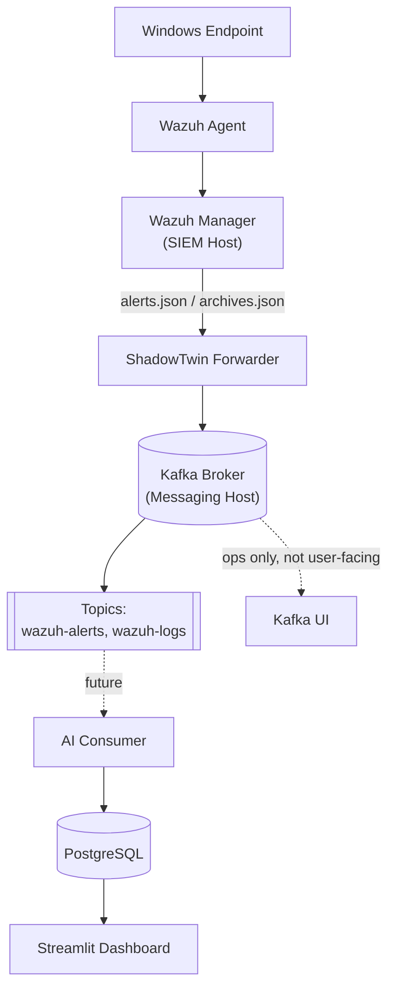

# Infrastructure Topology (public, genericized)

A sleek, high-level view of the infrastructure behind
[`PROJECT_STATUS.md`](PROJECT_STATUS.md) — enough for anyone reading the
repo to understand the shape of the system, with no real hostnames,
container IDs, or IPs. For the actual topology (host names, addresses),
see the local-only, gitignored [`INFRASTRUCTURE.md`](INFRASTRUCTURE.md) —
that file never leaves your machine.

## Roles (generic, no real names)

| Role | What runs there |
|---|---|
| **SIEM Host** | Wazuh Manager, OpenSearch, Wazuh Dashboard |
| **Messaging Host** | Kafka (KRaft mode), Kafka UI |
| *(Endpoint)* | Wazuh Agent, generates the raw telemetry |

Two logical hosts today; nothing here implies a specific number of
physical/virtual machines, cloud provider, or network layout — see the
private `INFRASTRUCTURE.md` for that if you have access to it.

## Notes

- Kafka UI is operations-only tooling (broker/topic inspection). It is
  never a dependency of any user-facing feature — see the note in
  `PROJECT_STATUS.md`.
- This diagram covers only what's actually deployed or actively being
  built (`PROJECT_STATUS.md`'s "Completed"/"Current work"), not the full
  target design in [`architecture.md`](architecture.md).
