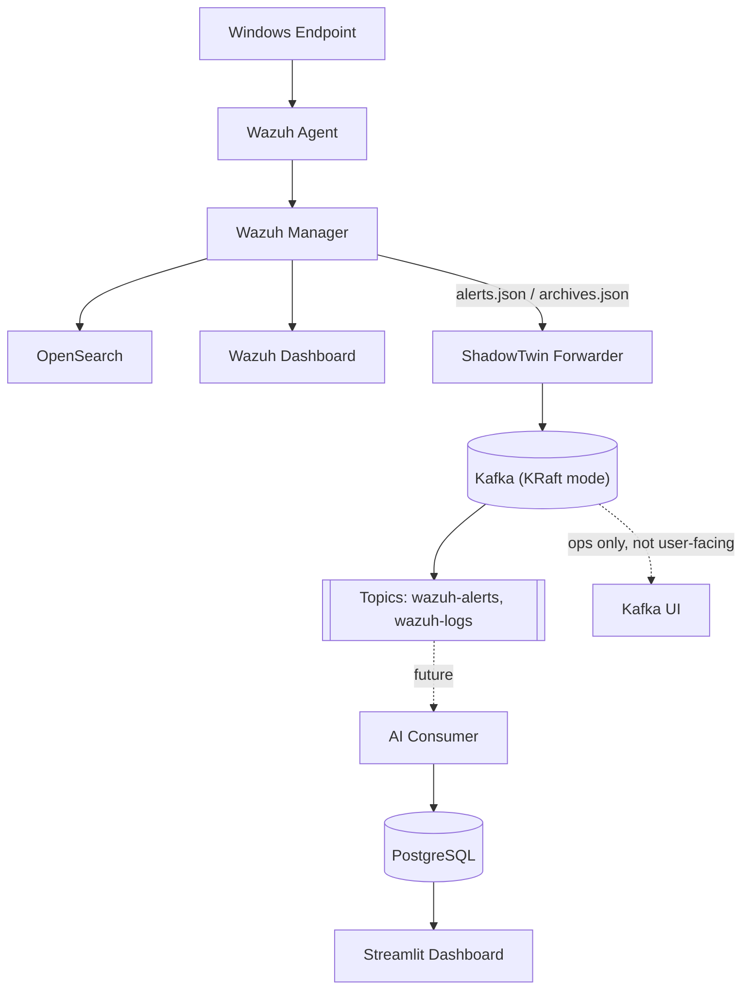

# Infrastructure Topology (public)

A sleek, high-level view of the infrastructure behind
[`PROJECT_STATUS.md`](PROJECT_STATUS.md) — the actual services/software in
use, so anyone reading the repo can understand and relate to the stack.
What's deliberately left out: real hostnames, container IDs, and IPs. For
those, see the local-only, gitignored [`INFRASTRUCTURE.md`](INFRASTRUCTURE.md)
— that file never leaves your machine.

## Component grouping

Which services are co-located matters for understanding the system, so
it's shown here — just without real host identifiers:

- **Detection stack** (one host): Wazuh Manager, OpenSearch, Wazuh Dashboard.
- **Messaging stack** (a second host): Kafka (KRaft mode), Kafka UI.
- **Endpoint**: Wazuh Agent, generating the raw telemetry.

Nothing here implies a specific number of physical/virtual machines, cloud
provider, or network layout — see the private `INFRASTRUCTURE.md` for that.

## Notes

- Kafka UI is operations-only tooling (broker/topic inspection). It is
  never a dependency of any user-facing feature — see the note in
  `PROJECT_STATUS.md`.
- This diagram covers only what's actually deployed or actively being
  built (`PROJECT_STATUS.md`'s "Completed"/"Current work"), not the full
  target design in [`architecture.md`](architecture.md).
