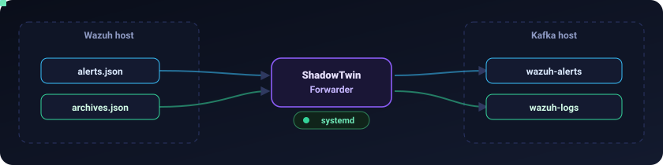

# ShadowTwin Forwarder

> Part of [ShadowTwin](../README.md). This is the ingestion edge of the
> pipeline: `Wazuh → Forwarder → Kafka`. See [`../docs/TOPOLOGY.md`](../docs/TOPOLOGY.md)
> for where it sits in the whole system.

Real-time forwarder that tails Wazuh's NDJSON log files and publishes every
new event to Apache Kafka. It is completely independent of the Wazuh →
Filebeat → OpenSearch pipeline: it only *reads* the files, so the Wazuh
Dashboard keeps working exactly as before.

<div align="center">



</div>

| File                                    | Kafka topic    |
|-----------------------------------------|----------------|
| `/var/ossec/logs/alerts/alerts.json`    | `wazuh-alerts` |
| `/var/ossec/logs/archives/archives.json`| `wazuh-logs`   |

## 🚀 Quick install (production)

```bash
sudo ./install_service.sh
```

That is the entire installation. The script detects the project directory,
creates the `shadowtwin` service user (joined to group `wazuh`), builds the
virtualenv, installs `/etc/shadowtwin-forwarder/config.yaml` (never
overwriting an existing one), installs and enables the systemd unit, starts
the service, and verifies it with a health check.

From then on the service starts at boot and the only commands an
administrator needs are:

```bash
systemctl start shadowtwin-forwarder
systemctl stop shadowtwin-forwarder
systemctl restart shadowtwin-forwarder
systemctl status shadowtwin-forwarder
journalctl -u shadowtwin-forwarder -f
```

Remove with `sudo ./uninstall_service.sh` (config, offsets and logs are
kept for reinstalls; add `--purge` to delete those too).

## ⚙️ How it works

* **Watcher** (`watcher.py`) — follows each file like `tail -F`: it keeps a
  handle open, reads new complete lines as they appear, and compares the
  path's inode/size against the handle whenever it reaches end-of-file. That
  detects rotation (inode change), truncation (`copytruncate`), deletion and
  re-creation, all without a restart. Already-read data is never re-scanned.
* **Producer** (`producer.py`) — confluent-kafka (librdkafka) with
  `acks=all`, idempotence, lz4 compression, `linger.ms`/`batch.size`
  batching, automatic reconnect and infinite retries. When the local queue
  fills up (broker down), the forwarder blocks instead of dropping events,
  and resumes automatically when Kafka returns.
* **State** (`state.py`) — for every file, the inode and the byte offset of
  the next unread line are checkpointed to `state.json` (atomic write:
  temp file + fsync + rename; the previous checkpoint is kept as
  `state.json.bak`). An offset only advances after Kafka has acknowledged
  **every** message up to it, so a restart resumes exactly where it stopped
  and re-sends at most the few messages that were still in flight —
  at-least-once delivery, no gaps.
* **JSON** — each line is validated with `json.loads`. Malformed lines are
  logged and skipped; the process never crashes on bad input. Valid lines
  are forwarded byte-for-byte as they appear in the file.
* **Shutdown** — SIGINT/SIGTERM flush the producer (up to 30 s), checkpoint
  offsets, close files, then exit. The unit gives it 45 s before SIGKILL.
* **Startup validation** — every start logs the result of the Kafka,
  Topics, Files and Permissions checks. Broken permissions abort the start
  (offsets could be lost silently); an unreachable broker or missing source
  file only warns, because both heal without intervention.

## 🩺 Health checks

```bash
# For monitoring/cron — exit 0 when healthy:
.venv/bin/python app.py --health --config /etc/shadowtwin-forwarder/config.yaml

# Human-readable, with details:
.venv/bin/python app.py --validate-config --config /etc/shadowtwin-forwarder/config.yaml
Kafka OK  (connected to localhost:9092; 1 broker(s) in cluster)
Topics OK  (wazuh-alerts, wazuh-logs exist)
Files OK  (...alerts.json readable; ...archives.json readable)
Permissions OK  (/var/lib/shadowtwin-forwarder writable; /var/log/shadowtwin-forwarder writable)
```

Run them as the service user so file permissions are tested realistically:
`sudo -u shadowtwin .venv/bin/python app.py --health --config ...`.
Check modes never write logs or state — they are safe to run as anyone.

## 📋 Requirements

* Ubuntu 24.04 (Python 3.12), or Docker
* Network access from the Wazuh host to the broker `localhost:9092`
* Read access to `/var/ossec/logs` (group `wazuh` — the install script
  handles this)
* Topics `wazuh-alerts` and `wazuh-logs` on the broker (create them via
  Kafka UI or `kafka-topics.sh --create` on the Kafka host, unless auto-creation is
  enabled)

> `archives.json` only exists when Wazuh's `<logall_json>` option is
> enabled. If it is absent the forwarder waits for the file to appear and
> logs a single warning — nothing breaks.

## 🔧 Configuration

Everything lives in `/etc/shadowtwin-forwarder/config.yaml`. The `topics`
and `files` sections are joined by key: `files.alerts` is published to
`topics.alerts`, and more pairs can be added the same way.

```yaml
kafka:
  bootstrap_servers:
    - localhost:9092
  client_id: shadowtwin-forwarder
  compression: lz4
  linger_ms: 50            # batching delay (ms)
  batch_size: 131072       # bytes per partition batch
  message_timeout_ms: 0    # 0 = retry forever, never drop a queued event
  queue_max_messages: 100000

topics:
  alerts: wazuh-alerts
  archives: wazuh-logs

files:
  alerts: /var/ossec/logs/alerts/alerts.json
  archives: /var/ossec/logs/archives/archives.json

watcher:
  poll_interval: 0.25      # seconds between checks when files are idle
  batch_lines: 500         # max lines read per file per iteration
  start_from: end          # end | beginning (first run only, when no state exists)

logging:
  level: INFO
  file: /var/log/shadowtwin-forwarder/forwarder.log
  max_bytes: 10485760
  backup_count: 5
  console: true            # console output = journald when run under systemd

state:
  file: /var/lib/shadowtwin-forwarder/state.json
  save_interval: 2.0
```

After editing: `sudo systemctl restart shadowtwin-forwarder`.

Environment overrides (containers, or `/etc/shadowtwin-forwarder/forwarder.env`
loaded by the unit):

| Variable                             | Overrides                |
|--------------------------------------|--------------------------|
| `SHADOWTWIN_CONFIG`                  | path of `config.yaml`    |
| `SHADOWTWIN_KAFKA_BOOTSTRAP_SERVERS` | `kafka.bootstrap_servers` (comma-separated) |
| `SHADOWTWIN_LOG_LEVEL`               | `logging.level`          |
| `SHADOWTWIN_STATE_FILE`              | `state.file`             |

## 📜 Logs

* **journald** — `journalctl -u shadowtwin-forwarder -f` (everything the
  console handler prints, tagged `shadowtwin-forwarder`).
* **Rotating file** — `/var/log/shadowtwin-forwarder/forwarder.log`
  (10 MiB × 5 backups by default).

Each start logs a banner (version, Python, brokers, file→topic mapping,
config/state paths) followed by the startup check results. Once per minute
a stats line reports throughput and positions:

```
stats: produced=1284 acked=1284 failed=0 parse_errors=0 reconnects=1 queued=0 in_flight=0 | offsets: alerts=52117340, archives=9441207
```

## 🧩 Systemd

`systemd/shadowtwin-forwarder.service` (installed by `install_service.sh`,
which rewrites the paths to wherever the checkout lives):

* `Restart=always` + `RestartSec=5` — survives crashes.
* `Wants=`/`After=network-online.target` — starts after boot networking.
* Runs as `shadowtwin` with `SupplementaryGroups=wazuh`.
* `StateDirectory`/`LogsDirectory` — systemd creates and owns
  `/var/lib/shadowtwin-forwarder` and `/var/log/shadowtwin-forwarder`.
* `KillSignal=SIGTERM`, `TimeoutStopSec=45` — clean flush on stop.
* Hardening: `ProtectSystem=strict`, `ProtectHome`, `NoNewPrivileges`,
  `PrivateTmp`, and more.

Manual installation, if you prefer it over the script:

```bash
sudo cp systemd/shadowtwin-forwarder.service /etc/systemd/system/
# adjust the /opt/shadowtwin-forwarder paths if your checkout lives elsewhere
sudo systemctl daemon-reload
sudo systemctl enable --now shadowtwin-forwarder
```

## Makefile

```
make install    # sudo ./install_service.sh
make uninstall  # sudo ./uninstall_service.sh
make restart    # sudo systemctl restart shadowtwin-forwarder
make status     # systemctl status
make logs       # journalctl -f
make health     # app.py --health
make validate   # app.py --validate-config
make lint       # ruff check .        (make dev first)
make test       # tests/smoke_test.py (make venv first; Linux only)
```

## Upgrade

```bash
cd /path/to/shadowtwin-forwarder
git pull                      # or copy the new files in
sudo ./install_service.sh     # reinstalls deps + unit, restarts the service
```

The installer never touches `/etc/shadowtwin-forwarder/config.yaml` or the
state file, so the upgraded service resumes from the same offsets. Compare
your config against the shipped `config.yaml` for new options.

## 🛟 Recovery

| Scenario | What happens |
|----------|--------------|
| Kafka goes offline | Events buffer locally (`queue_max_messages`); when the buffer is full the watchers pause. Nothing is dropped, delivery resumes automatically, and the stats line counts the recovery in `reconnects`. |
| Wazuh restarts / rotates logs | Rotation, truncation, deletion and re-creation are detected via inode/size checks; the watcher reopens and continues. No duplicates, no gaps. |
| Forwarder crashes / host reboots | systemd restarts it (5 s backoff / at boot). Offsets are loaded from `state.json`; only messages that were in flight during the crash are re-sent (at-least-once). |
| `state.json` corrupt or lost | The previous checkpoint `state.json.bak` is loaded automatically; the bad file is kept as `state.json.corrupt` for inspection. If both are unusable, the forwarder starts fresh per `watcher.start_from`. |
| Start over deliberately | `sudo systemctl stop shadowtwin-forwarder`, delete `/var/lib/shadowtwin-forwarder/state.json*`, start again. |

## 🐳 Docker (alternative to systemd)

Run on the Wazuh host (the container needs the Wazuh log files bind-mounted):

```bash
cp .env.example .env
# set WAZUH_GID to the host's wazuh group id: getent group wazuh | cut -d: -f3
docker compose up -d --build
docker compose logs -f
```

The compose file mounts `/var/ossec/logs` read-only, keeps state and logs
in named volumes, and joins the container user to the host's `wazuh` group.

## 🛠️ Development

```bash
make venv                     # virtualenv + runtime deps
make dev                      # + ruff
make lint
make test                     # Linux only (rotation tests need real inodes)
python app.py --config config.yaml   # run in the foreground
```

The project is also an installable package (`pyproject.toml`):
`pip install .` provides the `shadowtwin-forwarder` console command and
proper versioning for future CI/CD.

## 🧯 Troubleshooting

**Service won't start** — `journalctl -u shadowtwin-forwarder -e`. The
startup validation logs exactly which check failed. A Permissions failure
(state/log directory not writable) is the only one that aborts start.

**`Permission denied` opening `alerts.json`** — the service user is not in
the `wazuh` group. `sudo ./install_service.sh` sets this up; verify with
`sudo -u shadowtwin -g wazuh head -c1 /var/ossec/logs/alerts/alerts.json`.

**`archives.json does not exist yet; waiting for it`** — Wazuh only writes
that file when `<logall_json>yes</logall_json>` is set in
`/var/ossec/etc/ossec.conf`. The forwarder attaches automatically once the
file appears; enabling that option is a Wazuh-side decision.

**`all Kafka brokers are down`** — the broker is unreachable. Verify
`nc -vz localhost 9092` from the Wazuh host, and that Kafka's
`advertised.listeners` announces `localhost:9092` (not `localhost`).
The forwarder keeps buffering and reconnecting; nothing is lost.

**`Topics FAIL - missing on the broker`** — create `wazuh-alerts` and
`wazuh-logs` on the Kafka host, or enable topic auto-creation.

**`skipping malformed JSON line`** — a line in the source file was not
valid JSON (usually a torn write from a crash). It is logged with a preview
and skipped; everything else continues.

**Duplicate events in Kafka after a crash** — expected worst case:
delivery is at-least-once. Only messages in flight during the crash are
re-sent. Consumers should deduplicate if exactly-once matters.

**Verify the pipeline end to end** — on the Kafka host:
`kafka-console-consumer.sh --bootstrap-server localhost:9092 --topic wazuh-alerts`
while triggering an alert on the Wazuh host (e.g. a failed SSH login), or watch the
topic counters in Kafka UI.

## 🗂️ Project layout

```
shadowtwin-forwarder/
├── app.py                     # entry point: modes, wiring, main loop, signals
├── watcher.py                 # tail -F engine (rotation/truncation/deletion safe)
├── producer.py                # confluent-kafka producer wrapper
├── state.py                   # atomic offset store + backup + ack-order tracking
├── config.py                  # YAML config loading + validation
├── checks.py                  # operational checks (--health / --validate-config / startup)
├── logger.py                  # rotating-file + console logging setup
├── version.py                 # single source of the version number
├── config.yaml                # runtime configuration
├── requirements.txt
├── pyproject.toml             # packaging + ruff config
├── Makefile
├── install_service.sh         # one-command production install
├── uninstall_service.sh
├── Dockerfile
├── docker-compose.yml
├── .env.example
├── systemd/
│   └── shadowtwin-forwarder.service
└── tests/
    └── smoke_test.py
```
